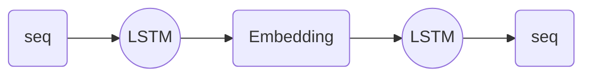

# Conclusion By Myself
This paper is trying to deal the problems of traditional DNNs can not be used to map sequences to sequences.
It used two LSTMs architecture, one map the input sequence to a fix dimensional vector and another decode the vector to the target sequence.

And this paper gives a phenomenon looks strange, that is the reversed input can lead a better output than the normal form. And the author gives a guess about the reason.  They said that it may caused by the introduction of many short term dependencies to the dataset.
Normally, when we translate "ABCD" to "abcd", the "A" is far from "a", each char is far from its target too. But in the reverse form, what we translating is "DCBA" to "abcd", in this form, the average distance between corresponding chars are not chang, but "A" is closer with "a", and the first few chars in the inputs are closer with their targets. The problem's minimal time lag is reduced.
Honestly, I don't understand why can cause this. I will do more survey on it soon.
# Abstract
Deep Neural Networks (DNNs) are powerful models that have achieved excellent performance on difficult learning tasks.
Although DNNs work well whenever large labeled training set are available, they cannot be used to map sequences to sequences.
In this paper, we present a general end-to-end approach to sequence learning that makes minimal assumptions on the sequence structure.
Our method uses a multilayered LSTM to map the input sequence to a vector of a fixed dimensionality, and then another deep LSTM to decode that target sequence from the vector.
Our main result is that on an English to French translation task from the WMT-14 dataset, the translations produced by the LSTM achieve a BLEU score of 34.8 on the entire test set, where the LSTM's BLEU score was penalized on out-of-vocabulary words.
Additionally, the LSTM did not have difficulty on long sentences.
For comparison, a phrase-based SMT system achieves a BLEU score of 33.3 on the same dataset.
When we used the LSTM to rerank the 1000 hypotheses produced by the aforementioned SMT system, its BLEU score increases to 36.5, which is close to the previous SOTA.
The LSTM also learned sensible phrase and sentence representations that are sensitive to word order and are relatively invariant to the active and the passive voice.
Finally, we found that reversing the order of the words in all source sentences (but not target sentences) improved the LSTM's performance markedly, because doing so introduced many short term dependencies between the source and the target sentence which made the optimization problem easier.
# Key Points By AI
- DNNs are extremely powerful machine learning models that achieve excellent performance on difficult problems such as speech recognition and visual object recognition
- Large DNNs can be trained with supervised back-propagation whenever the labeled training set has enough information to specify the network's parameters
- Our best results are obtained with an ensemble of LSTM that differ in their random initializations and in the random order of mini-batches
- We showed that a large deep LSTM with a limited vocabulary can outperform a standard SMT-based system whose vocabulary is unlimited on a large-scale MT task
- We were initially convinced that the LSTM would fail on long sentences due to its limited memory, and other researchers reported poor performance on long sentences with a model similar to ours
- LSTM trained on the reversed dataset had little difficulty translating long sentences

# File
[[1409.3215] Sequence to Sequence Learning with Neural Networks (arxiv.org)](https://arxiv.org/abs/1409.3215) 